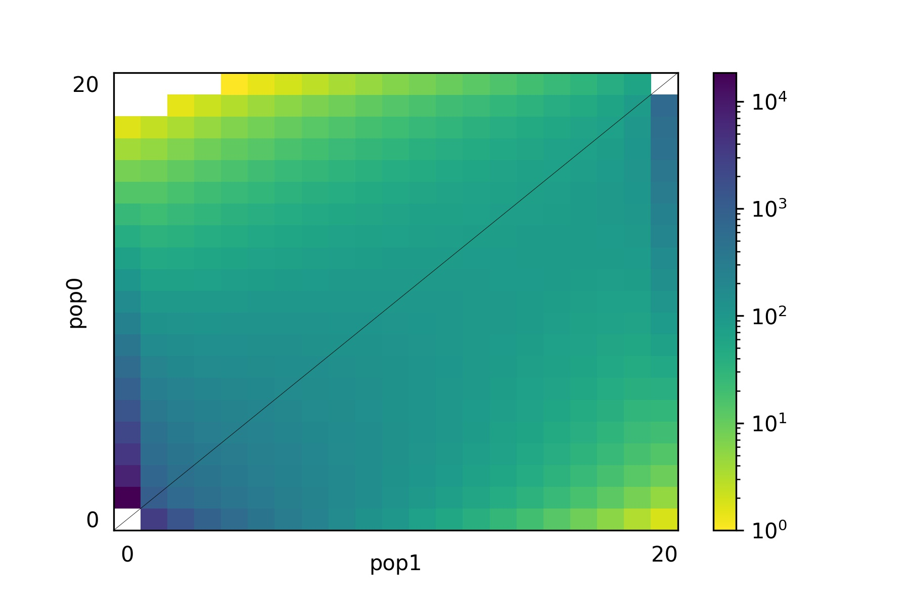

# Application of machine learning methods to approximate demographic history parameters from allele frequency spectrum

*Bioinformatics Institute, 2022*

*Author: E. E. Gorelkina*

*Supervisor: E. E. Noskova*

## Goals

Full-fledged genetic data are not used to output demographic history parameters, as they require a lot of computing resources. Therefore, they use various statistics based on these data. One of these statistics is the allele-frequency spectrum. In the simplest case, it can be represented as a multidimensional tensor (matrix). Existing methods for deriving demographic history parameters (dadi, moments) use local optimization algorithms that work faster for given initial approximations of parameters close to optimal. In this project, it is proposed to apply the simplest machine learning methods for approximate prediction of the parameters of the demographic history of two populations. As machine learning algorithms, a choice is offered: random forest or convolutional neural networks. It is required to generate data, train and validate the selected method on them.

## Results

### 1. Predicted vs true (independent parameters)

#### True: 
Size of subpopulation 1 after split: 1.0

Size of subpopulation 2 after split: 0.1

Migration rate from subpopulation 2 to subpopulation 1: 5.0

Migration rate from subpopulation 1 to subpopulation 2: 4.19419419

Time of split: 0.05

allele-frequency spectrum

#### Predict: 

Size of subpopulation 1 after split: 0.99994725

Size of subpopulation 2 after split: 0.1

Migration rate from subpopulation 2 to subpopulation 1: 4.99998889

Migration rate from subpopulation 1 to subpopulation 2: 4.19488176

Time of split: 0.05

allele-frequency spectrum

### 2. Predicted vs true (chained multioutput regression)

#### Predict: 

Size of subpopulation 1 after split: 0.99994725

Size of subpopulation 2 after split: 0.1

Migration rate from subpopulation 2 to subpopulation 1: 4.99998889

Migration rate from subpopulation 1 to subpopulation 2: 4.19393344

Time of split: 0.05

allele-frequency spectrum

