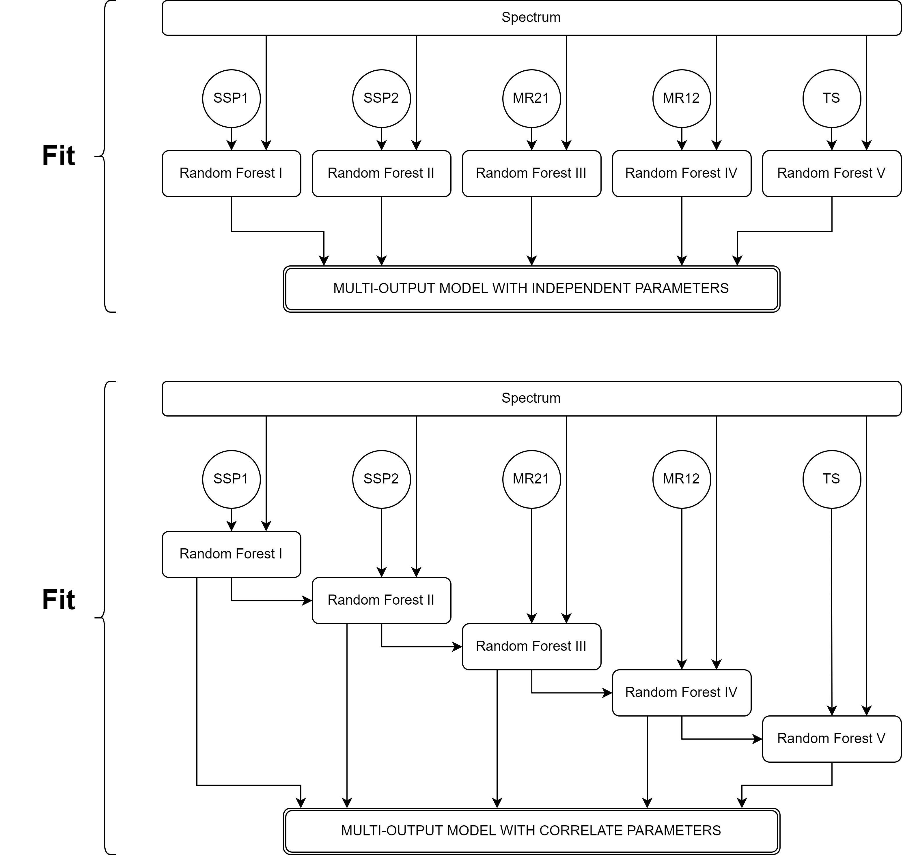
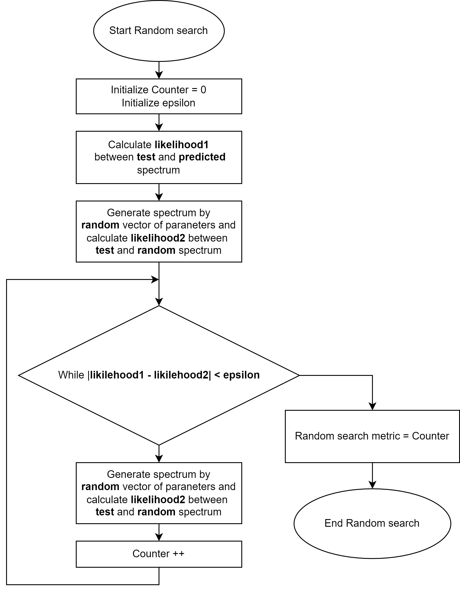

# Application of machine learning methods to approximate demographic history parameters from allele frequency spectrum

*Bioinformatics Institute, 2022*

*Author: E. E. Gorelkina*

*Supervisor: E. E. Noskova*

## Goals
- Сhoose a model of the demographic history of two populations on which **the effectiveness of the methods will be explored**;
- Generate data using dadi library;
- Train a machine learning Multi-Output Regression model that assumes all **parameters are independent (model I)**;
- Train a machine learning Multi-Output Regression model that assumes all **parameters correlate (model II)**;
- Validate models by R2 metric;
- Reveal the number of iterations required for the **random search** to archive the same likelihood as ML model.

## Methods
To implement the **pipeline** was used **Dadi package**, in which there are methods that allow generating an allele-frequency spectrum according to the parameters of demographic history and counting the likelihood. 

Selected [demographic history model](https://github.com/noscode/demographic_inference_data/tree/master/2_DivMig_5_Sim) has five parameters that we want to predict.This model has the next parameters:
- Size of subpopulation 1 after split (SSP1);
- Size of subpopulation 2 after split (SSP2);
- Migration rate from subpopulation 2 to subpopulation 1 (MR21);
- Migration rate from subpopulation 1 to subpopulation 2 (MR12);
- Time of split (TS).

The symbols in parentheses will be used in the scheme of operation of multi-output machine learning models for convenience.

As a machine learning model, a random forest was taken as the simplest model. Below is a diagram of how multi-output models will be trained. 

As you can see here, everything depends on the location of the parameters in the vector of the predicted parameters: $$[PSS1, \ PSS2, \ MR21, \ MR12,  \ TS]$$.
#### Random search 
The random search algorithm is given in the form of a flowchart below. Such a search should be carried out for each spectrum from the test sample. The **likelihood** here is calculated using the dadi library, then all the results are averaged.

Also, the **coefficient of determination** was used as a metric:  $$R^2=1-\frac{\hat{\sigma}^2}{\hat{\sigma}_y^2}$$ is the proportion of the variation in the dependent variable that is predictable from the independent variable(s).

## Results
### Pipeline
The file contains a complete pipeline of the research done, divided into sections: data preparation and generation of datasets, selection of machine learning model, train and test it, random search algorithm.

### Predicted vs true: for example, for the First dataset
#### True: 
- Size of subpopulation 1 after split: 62.89603
- Size of subpopulation 2 after split: 15.38311
- Migration rate from subpopulation 2 to subpopulation 1: 7.05037
- Migration rate from subpopulation 1 to subpopulation 2: 0.45979
- Time of split: 0.03093
- True allele-frequency spectrum, generated by this paraneters:

#### Predicted by model I (independent paraneters):  
- Size of subpopulation 1 after split: 62.85306
- Size of subpopulation 2 after split: 15.64899
- Migration rate from subpopulation 2 to subpopulation 1: 7.47512
- Migration rate from subpopulation 1 to subpopulation 2: 0.34861
- Time of split: 0.03169
- Predicted allele-frequency spectrum, generated by this paraneters

#### Predicted by model II (correlate parameters):  
- Size of subpopulation 1 after split: 62.85306
- Size of subpopulation 2 after split: 16.36295
- Migration rate from subpopuation 2 to subpopulation 1: 7.45203
- Migration rate from subpopulation 1 to subpopulation 2: 0.37532
- Time of split: 0.03156
- Predicted allele-frequency spectrum, generated by this paraneters

### Metrics

## Conclusions
For the selected demographic history model and the selected machine learning model, the predictions turned out to be quite accurate.
The random search metric is interpreted as follows: if it is greater than 50 (such a number of random points is used in classical optimization), then we get acceleration. For all the models obtained, this metric was about 1000, that is, there is an acceleration of predictions.
For future research and development, this approach can be made more universal by training machine learning models on different demographic history models.
As an alternative possible machine learning model, you can use a convolutional network, for example, when there are three or more populations in the demographic history.

## References
Ekaterina Noskova's repository where the demographic history model was taken from: https://github.com/noscode/demographic_inference_data

Documentation for the Random Forest machine learning model: https://scikit-learn.org/stable/modules/generated/sklearn.ensemble.RandomForestRegressor.html#sklearn.ensemble.RandomForestRegressor

Multiclass and multioutput algorithms: https://scikit-learn.org/stable/modules/multiclass.html#

Dadi package for generate allele-frequency spectrums: https://dadi.readthedocs.io/en/latest/api/dadi/

## Startup instructions

### Installing packages

To install dadi, you can use the command:

    pip install dadi
    
### Running simple example
    
Next you need to download all the files available in folder, named simple_command_line_example, except for files with the jpeg extension, and save them for convenience in a separate directory on your local computer (it is recommended to use Ubuntu v.18 and higher), then, depending on your desire to test any model, you need to enter the command:

    python example.py MultiOutputRegressor1.sav y_test1.txt X_test1.txt 
    
or

    python example.py RegressorChain1.sav y_test1.txt X_test1.txt
    
### Pipeline running

You can run this experiment in a flask by first creating an **ML_DI folder** on your Google drive and uploading all files from the sample_data and sample_models directories to it, pre-unzipping them if necessary. Or you can repeat the entire pipeline without downloading files, the main thing is to connect Google drive to your colab and create the desired folder in it.

It should be noted that there are two datasets, the first `X_test1` and the second `X_test2`, predictions `y_pred` 1 and `y_pred3` were made for `X_test1`, which were made using **model I** and **model II**, similarly, predictions `y_pred2` and `y_pred4` were made for `X_test2`.

Thus, for further use in random search, remember the rule: for a dataset with an odd number, the names of the predictions have odd numbers, for a dataset with an even number, the predictions have even numbers.
